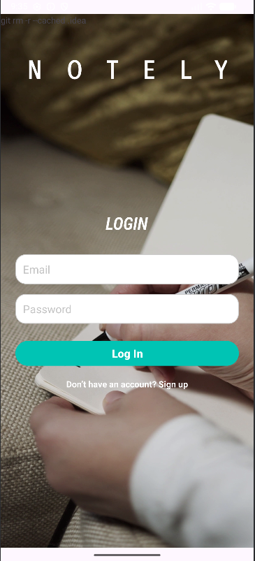
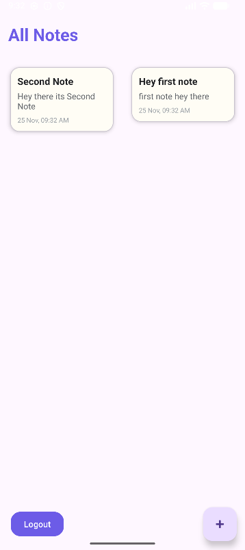
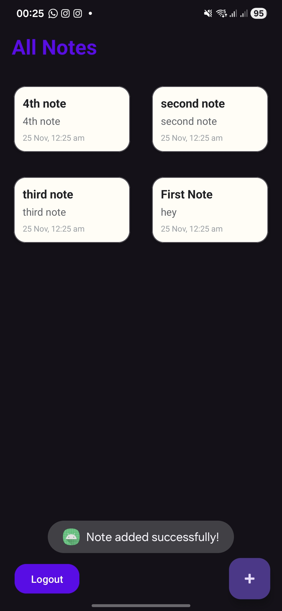
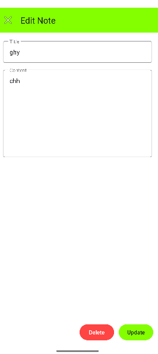

# Notely 📝

Notely is a simple, clean notes app built for Android with **Firebase Authentication** and **Cloud Firestore**.  
Each user gets their own secure notes in the cloud – add, edit, delete and sync notes across devices.

> Tech stack: **Java**, **Firebase Auth**, **Cloud Firestore**, **Material Components**

---

## ✨ Features

- 🔐 **Email & Password Authentication** (Firebase Auth)
- ☁️ **Cloud-synced notes** stored in Firestore per user  
  `users/{uid}/notes`
- 📝 **Create, edit, delete notes**
- 📌 **Pinned notes** appear first
- 🕒 **Notes sorted by latest timestamp**
- 📱 **RecyclerView grid layout** for notes
- 🚪 **Logout support** (clears session and returns to login)

---

## 📸 Screenshots

<p float="left">
  
  
  
  
</p>

---

## 🧱 Architecture & Data Model

- **UI**: Activities + RecyclerView + custom adapter for notes
- **Auth**: Firebase Authentication (email/password)
- **Database**: Cloud Firestore

Firestore structure:

```text
users
  └── {uid}
        └── notes
              ├── {noteId}
              │     ├── title: String
              │     ├── content: String
              │     ├── pinned: Boolean
              │     └── timestamp: com.google.firebase.Timestamp
              └── ...
